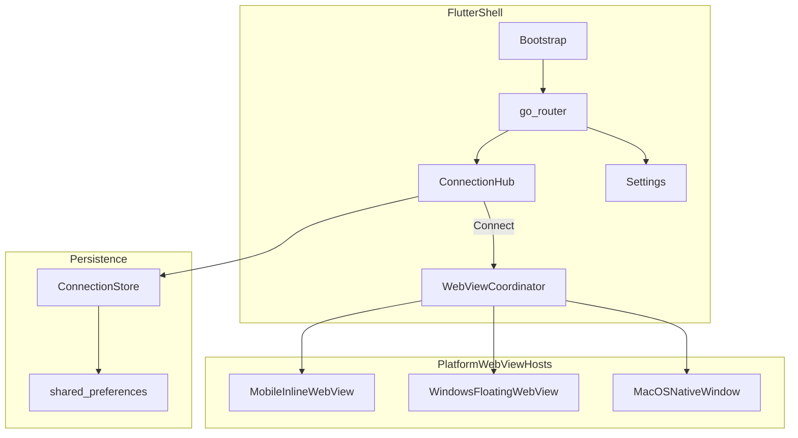

# Architecture

This template wraps remote web applications in native Flutter shells across desktop and mobile.

## Overview



## Layers

### Presentation (`lib/features/`)

| Feature | Responsibility |
|---|---|
| `connection/` | Server list, add/edit URLs, connect actions |
| `settings/` | Theme, reconnect behavior, data management |
| `shell/` | Bootstrap splash, auto-reconnect on launch |
| `webview/` | Inline WebView screen (mobile/Windows), session screen (macOS) |

### Application (`lib/app.dart`)

- Material 3 theming (light/dark/system)
- `go_router` routes: `/`, `/hub`, `/add`, `/settings`, `/webview/:id`, `/session/:id`
- Bootstrap redirect when auto-reconnect is enabled

### Core (`lib/core/`)

- `AppConfig` — fork customization (name, bundle id, URL allowlist)
- `UrlValidator` — normalizes and validates server URLs
- Shared widgets: `ConnectionCard`, `EmptyState`, `SettingsSection`

### Services (`lib/services/`)

- `ConnectionStore` — JSON persistence via `shared_preferences`
- `WebViewCoordinator` — connect/disconnect lifecycle
- `WebViewHost` — platform-specific WebView implementations

## Platform WebView strategy

| Platform | Package | Presentation | Notes |
|---|---|---|---|
| Android | `webview_flutter` | Inline full-screen route | Flutter app bar for disconnect/reload |
| iOS | `webview_flutter` | Inline full-screen route | Same as Android; requires Xcode signing for device builds |
| Windows | `webview_win_floating` | Inline via floating native WebView | WebView2 runtime required; no Flutter overlays above WebView |
| macOS | `desktop_webview_window` | Separate native window | Avoids Impeller/platform-view glitches; Flutter shows session screen |
| Linux | Stub | N/A | Returns availability error |

**Desktop constraint (Windows):** Flutter widgets cannot render above the floating WebView. Connection Hub and Settings are shown before WebView takeover. Disconnect hides the WebView before returning to Flutter routes.

## State management

**Riverpod** is used throughout:

- `connectionsProvider` — saved server list
- `settingsProvider` — theme and reconnect preferences
- `webViewCoordinatorProvider` — active WebView session
- `activeConnectionProvider` — currently connected server

## Data model

```dart
SavedConnection {
  id: String          // UUID
  displayName: String
  url: String         // normalized https://...
  lastUsedAt: DateTime?
}
```

Stored as JSON in `shared_preferences` under `connections` and `last_used_connection_id`.

## Routing flow

1. `/` — Bootstrap: load prefs, optionally auto-reconnect
2. `/hub` — Connection Hub (default landing)
3. `/add` — Add or edit a server (pass `SavedConnection` via `extra` when editing)
4. `/settings` — Settings screen
5. `/webview/:id` — Inline WebView (Android, iOS, Windows)
6. `/session/:id` — Session status while macOS native window is open

## Performance guidelines

- WebView is created only when the user taps **Connect** (fast cold start)
- One WebView instance per session; disposed on disconnect
- Windows uses native floating WebView (no texture rendering overhead)
- `const` widgets and Riverpod `select` minimize rebuilds
- Release builds: `flutter build <platform> --release`

## Testing

| Level | Tool | Coverage |
|---|---|---|
| Unit | `flutter test` | URL validation, connection store |
| Widget | `flutter test` | App boot smoke test |
| Manual | Per platform | Connect, disconnect, persistence, settings |

## CI pipeline

`.github/workflows/flutter.yml`:

1. `flutter analyze`
2. `flutter test`
3. `flutter build apk --release`
4. `flutter build windows --release`
5. `flutter build macos --release`

## Extending the template

Forks should add app-specific settings under the `SettingsSection` titled "App-specific settings" and optional URL allowlist patterns in `AppConfig.allowedUrlPatterns`. See [FORKING.md](FORKING.md).
