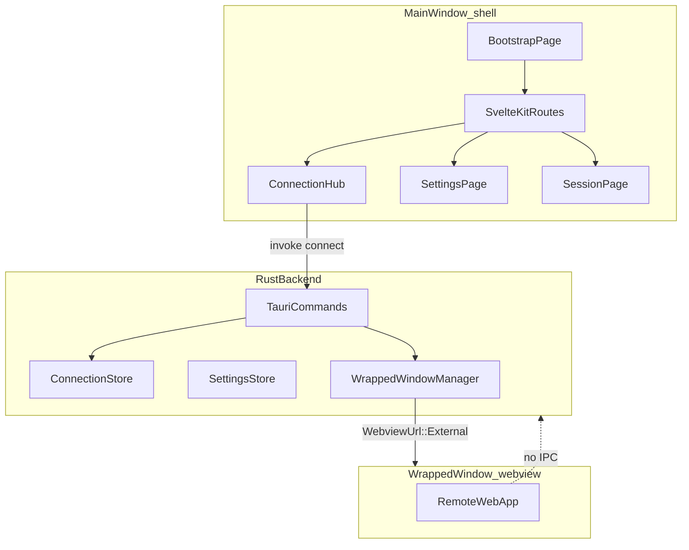

# Architecture

This template wraps remote web applications in native Tauri desktop shells.

## Overview



## Layers

### Frontend (`src/`)

| Route | Screen | Responsibility |
|---|---|---|
| `/` | Bootstrap | Load settings; optional auto-reconnect |
| `/hub` | Connection Hub | Saved servers, connect/delete/edit |
| `/add` | Add Connection | Create or edit a server (`?id=` for edit) |
| `/settings` | Settings | Theme, reconnect, clear data |
| `/session/[id]` | Session | Status while wrapped window is open |

Shared components: `ConnectionCard`, `EmptyState`, `SettingsSection`.

### Rust backend (`src-tauri/src/`)

| Module | Responsibility |
|---|---|
| `commands/connections.rs` | CRUD for saved servers |
| `commands/settings.rs` | Theme + reconnect preferences |
| `commands/session.rs` | Connect / disconnect / active session |
| `storage/` | JSON persistence in app data directory |
| `webview/wrapped_window.rs` | Opens/closes the `wrapped` WebView window |
| `url_validator.rs` | URL normalization and allowlist checks |
| `config.rs` | Fork customization constants (enforced server-side) |

## Dual-window WebView strategy

All desktop platforms use the same model:

1. **Main window (`main`)** — local SvelteKit shell only
2. **Wrapped window (`wrapped`)** — created at runtime with `WebviewUrl::External(url)`

Benefits:

- Shell UI always available
- Remote JavaScript cannot call Tauri commands (`wrapped` capability has empty permissions)
- Native WebView performance on every OS

When the user closes the wrapped window, Rust emits `session-ended` and the shell returns to the hub.

## Security model

| Window | Capability | Remote IPC |
|---|---|---|
| `main` | `shell.json` | Dev only (`localhost:1420`) for Vite HMR |
| `wrapped` | `wrapped.json` | None — empty permissions |

Additional guards:

- Rust URL validation before connect
- `on_navigation` callback blocks non-http(s) navigations
- Optional `allowedUrlPatterns` in `config.rs`

## Data model

```rust
SavedConnection {
  id: String,
  display_name: String,
  url: String,
  last_used_at: Option<DateTime<Utc>>,
}

AppSettings {
  theme_mode: system | light | dark,
  auto_reconnect_on_launch: bool,
}
```

Stored as `connections.json`, `settings.json`, and `last_used_connection_id.txt` under the app data directory.

## Tauri commands

| Command | Purpose |
|---|---|
| `list_connections` | Sorted server list |
| `add_connection` | Validate + save new server |
| `update_connection` | Edit existing server |
| `delete_connection` | Remove server |
| `clear_connections` | Settings: wipe all servers |
| `get_last_used_connection` | For auto-reconnect |
| `get_settings` / `update_settings` | App preferences |
| `set_theme_mode` / `set_auto_reconnect` | Partial settings updates |
| `connect` | Open wrapped window (async) |
| `disconnect` | Close wrapped window |
| `get_active_session` | Session page state |

## Testing

| Level | Tool | Coverage |
|---|---|---|
| Unit (TS) | Vitest | URL validation |
| Unit (Rust) | `cargo test` | URL validation, connection store |
| Manual | Per platform | Connect, disconnect, persistence |

## CI pipeline

`.github/workflows/tauri.yml` at the repo root:

1. `npm ci` + `npm test`
2. `cargo test` in `src-tauri/`
3. `npm run tauri build -- --no-bundle` on Linux, Windows, macOS

## Extending the template

Add app-specific settings widgets to the "App-specific settings" section in `src/routes/settings/+page.svelte`. See [FORKING.md](FORKING.md).
